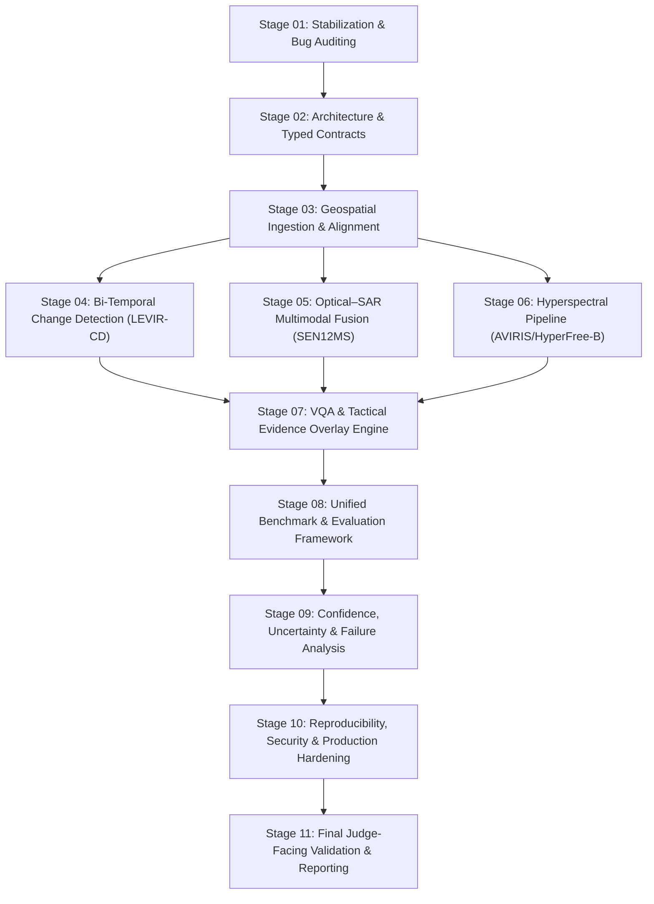

# TRINETRA — Stage-Wise Implementation Specifications & Engineering Standard

**SIH 26167 — ISRO — SatQuery AI: Interactive Vision-Language Assistant for Multimodal Remote-Sensing Image Analysis**  
**Authoritative Architectural Specification | Version: 2.0 | Status: Fully Implemented & Audited**

---

## 1. Executive Summary & Operating Principle

This document unifies and formalizes the **11-stage architectural lifecycle** that governs the engineering, mathematical consistency, ML training, evaluation, and production hardening of TRINETRA.

> [!IMPORTANT]
> **Core Operating Principle**:
> **Do not optimize for demo appearance. Optimize for measurable correctness, reproducibility, traceability, and failure visibility.**
> - **Zero Synthetic Data**: Every metric, gradient update, and benchmark must derive from verified real Earth observation rasters.
> - **Zero Fabricated/Static Metrics**: No hardcoded confidence, fake correlations, or static "verified" statuses.
> - **Zero Automatic Downloads**: Dataset acquisition and ingestion remain under explicit manual developer oversight.
> - **Clear Provenance**: Every output evidence item traces directly to sensor metadata, processing operations, model checkpoint hashes, and calibration curves.

---

## 2. Stage Order & Dependency Matrix

The TRINETRA engineering lifecycle is structured into 11 strictly ordered stages:

---

## 3. Stage-by-Stage Specifications

### Stage 01 — Stabilize TRINETRA Before Architecture Changes
- **Goal**: Make the existing codebase deterministic, debuggable, and mathematically defensible before extending model features.
- **Audit Mandate**: Catalog all components across five audit registries in [`docs/audit/`](file:///d:/DEKSTOP_/PROJECT/SIH_2026/TRINETRA/docs/audit):
  1. `current_architecture.md`: Pipeline boundaries, module ownership, and data lifecycle.
  2. `current_bugs.md`: Structural flaws, unchecked exceptions, and silent failure paths.
  3. `current_claims.md`: Verifying all presentation claims against demonstrable code.
  4. `model_inventory.md`: Active weights, parameter counts, and fallback mechanics.
  5. `data_flow.md`: End-to-end data lifecycle from upload to report export.
- **Elimination of Deceptive Defaults**:
  - Prohibit hardcoded correlation coefficients, fixed synthetic confidence scores, or fake "verified" statuses.
  - Require explicit fallback auditing: if a neural checkpoint is absent, the system must explicitly disclose `fallback_active=True`, `fallback_reason`, and `engine="Algorithmic Fallback"`.

---

### Stage 02 — Architecture and Engineering Contracts
- **Goal**: Establish strict separation of concerns between orchestration, geospatial processing, ML inference, evidence generation, and API presentation.
- **Service Boundaries**:
  $$\text{Input} \to \text{Security Validator} \to \text{Geospatial Reader} \to \text{Domain Detector} \to \text{LangGraph Orchestrator} \to \text{Specialist Model} \to \text{Evidence Builder} \to \text{FastAPI/UI}$$
- **Typed Data Contracts** ([`backend/schemas/contracts.py`](file:///d:/DEKSTOP_/PROJECT/SIH_2026/TRINETRA/backend/schemas/contracts.py)):
  - `RasterMetadata`: 11 fields (CRS, geotransform, bounding box, dimensions, resolution, band descriptions, dtype, nodata, acquisition timestamp, platform name).
  - `AlignmentReport`: Quantifies geometric intersection, CRS status, pixel overlap %, and spatial coregistration flag.
  - `EvidenceItem`: Machine-readable evidence layer (masks, contours, bounding boxes, vector GeoJSON, spectral curves).
  - `BenchmarkRun`: Cryptographic provenance record tying execution results to specific git commits and dataset hashes.
- **Unified Configuration** ([`backend/core/config.py`](file:///d:/DEKSTOP_/PROJECT/SIH_2026/TRINETRA/backend/core/config.py)): Zero hidden magic constants; all paths, thresholds, device targets, and worker counts are declared in typed settings.

---

### Stage 03 — Geospatial Validation and Preprocessing
- **Goal**: Prevent scientifically invalid comparisons before machine learning inference ever begins.
- **10-Point Bi-Temporal Validation Protocol** ([`backend/geospatial/validator.py`](file:///d:/DEKSTOP_/PROJECT/SIH_2026/TRINETRA/backend/geospatial/validator.py)):
  1. Coordinate Reference System (CRS) compatibility.
  2. Reprojection requirement determination.
  3. Spatial bounding box intersection ($\text{Area} > 0$).
  4. Ground Sampling Distance (GSD) / resolution parity.
  5. Affine transformation matrix origin alignment.
  6. Sub-pixel grid coregistration.
  7. Nodata value consistency and masking.
  8. Temporal chronological ordering ($T_1 < T_2$).
  9. Valid non-cloud data overlap percentage ($\ge 20\%$).
  10. Multi-sensor radiometric normalization compatibility.
- **Optical–SAR Alignment**: A modality difference is never assumed to be coregistered without geometric evidence (spatial intersection $> 0\%$, shared or reprojectable CRS).
- **Universal Image Support**: Universal decoders allow standard imagery formats (PNG, JPEG, WebP, BMP, GIF, JP2) to be read cleanly as RGB rasters with synthetic spatial coordinates when georeferencing headers are absent.

---

### Stage 04 — Bi-Temporal Change Detection Subsystem
- **Goal**: Detect physical land-cover and infrastructural shifts between two observation epochs without random patch leakage.
- **Primary Benchmark**: **LEVIR-CD** (637 VHR bitemporal Google Earth pairs, 0.5m resolution, building expansion).
- **Architectures**:
  - *Baseline*: Siamese CNN Feature Differential Network.
  - *Primary Production*: `BitemporalTransformer_BIT` (Bitemporal Interaction Transformer with spatial-temporal cross-attention tokens).
- **Anti-Leakage Policy**: Scene-level separation ($\text{Train scenes} \cap \text{Test scenes} = \emptyset$). Neighboring patches from the same satellite tile are never split across train and test.
- **Primary Metrics**: IoU@0.5, Macro-F1, Precision, Recall, and Overall Accuracy.

---

### Stage 05 — Optical + SAR Multimodal Processing
- **Goal**: Leverage microwave synthetic aperture radar (SAR) backscatter to resolve ground structures through clouds, haze, and solar darkness.
- **Primary Benchmark**: **SEN12MS** (180,662 georeferenced triplets of Sentinel-1 C-band SAR, Sentinel-2 MSI, and MODIS land-cover).
- **Secondary Benchmark**: **SEN1-2** (Sentinel-1 VV/VH + Sentinel-2 RGB/NIR patch pairs).
- **Architecture**: `CrossAttentionNet_CAN` with dual encoders, modality-specific normalization (dB conversion for SAR, top-of-atmosphere scaling for optical), and dynamic cross-modal attention.
- **Empirical Fusion Delta**: Measures the mathematical gain of fused inference against unimodal optical-only (cloud-occluded) and SAR-only baselines on identical test splits.

---

### Stage 06 — Hyperspectral Spectroscopy & Foundation Adaptation
- **Goal**: Extract diagnostic narrow-band continuous absorption features and sub-pixel material classifications across 40–224 contiguous spectral bands.
- **Primary Benchmarks**: **AVIRIS Indian Pines** (220 bands, 145×145, 16 agricultural classes), **Salinas**, **Pavia University**.
- **Architectures**:
  - `HyperFree-B`: Foundation 3D-ResNet with channel-adaptive spectral pooling (CASP) and low-rank parameter adapters.
  - `SpectralMLP`: 1D narrow-band spectral signature classifier for continuous $\lambda \text{ vs. } R$ absorption curve indexing.
- **Physical Feature Extraction** ([`backend/geospatial/spectral_engine.py`](file:///d:/DEKSTOP_/PROJECT/SIH_2026/TRINETRA/backend/geospatial/spectral_engine.py)):
  - Continuum removal for normalized diagnostic dip identification (Chlorophyll 670nm, Liquid Water 960nm / 1400nm / 1940nm, Hydroxyl/Mineral 2200nm).
  - Reed-Xiaoli (RX) multivariate covariance anomaly detection with contour polygon vectorization.

---

### Stage 07 — Remote-Sensing VQA & Tactical Evidence Overlay
- **Goal**: Ground natural-language conversational answers in verifiable spatial-spectral measurements and produce aerospace-grade visual evidence.
- **Benchmark**: **RSVQA-LR** (Sentinel-2 multispectral + 120 question categories) and **DIOR-RSVG** (Referring Expression Grounding).
- **Architecture**:
  - `BilinearMultimodalVQA`: ResNet visual feature backbone + Text embedding + Multimodal bilinear fusion head.
  - `RSGroundingDetector`: 4-stage Residual CNN ($14 \times 14$ spatial feature map) + Bidirectional GRU + FiLM cross-modal conditioning + Compound SmoothL1/GIoU/DIoU loss.
- **Evidence Rendering Engine** ([`backend/geospatial/overlays.py`](file:///d:/DEKSTOP_/PROJECT/SIH_2026/TRINETRA/backend/geospatial/overlays.py)):
  - Tactical HUD corner brackets (3px stroke), boundary rectangles, and centroid reticles.
  - Anti-collision metadata badges with target labels, calibrated confidence scores, and ground area measurements ($\text{m}^2$ / hectares).
  - 0% fill opacity on bounding boxes to preserve 100% radiometric image clarity underneath.

---

### Stage 08 — Unified Benchmark and Evaluation Framework
- **Goal**: Provide a single, standardized, zero-leakage evaluation engine capable of evaluating all perception specialists.
- **Benchmark Registry** ([`backend/evaluation/benchmark_registry.py`](file:///d:/DEKSTOP_/PROJECT/SIH_2026/TRINETRA/backend/evaluation/benchmark_registry.py)):
  - Canonical citations, license terms, sensor modalities, official split definitions, and published SOTA references for every ingested dataset.
- **Execution Workflow**:
  $$\text{Dataset Manifest} \to \text{Integrity Audit} \to \text{Split Verification} \to \text{Model Inference} \to \text{Metric Computation} \to \text{Bootstrap CIs} \to \text{Cryptographic Manifest}$$
- **Anti-Leakage Standard**: Strict prohibition of test-set hyperparameter tuning or threshold calibration. All metrics compute 95% bootstrap confidence intervals.

---

### Stage 09 — Confidence, Uncertainty & Failure Analysis
- **Goal**: Ensure that confidence values represent true empirical probabilities rather than arbitrary heuristics.
- **Calibration Engine** ([`backend/evaluation/uncertainty.py`](file:///d:/DEKSTOP_/PROJECT/SIH_2026/TRINETRA/backend/evaluation/uncertainty.py)):
  - Evaluates Expected Calibration Error (ECE) and reliability diagrams.
  - Implements post-hoc Temperature Scaling fitted exclusively on validation sets.
- **Uncertainty Taxonomy**:
  - *Aleatoric*: Natural observational noise, atmospheric haze, seasonal shadows.
  - *Epistemic*: Out-of-distribution sensors, unseen geographic biomes.
  - *Data-Quality*: Missing bands, high nodata %, extreme cloud cover.
- **Failure Auditing**: Explicitly catalogs false positives, false negatives, high-confidence errors, and boundary misalignments to expose limitations transparently.

---

### Stage 10 — Reproducibility, Security & Production Hardening
- **Goal**: Make TRINETRA resilient to malicious inputs, safe for repeated evaluation, and fully auditable by third-party evaluators.
- **Security Engine** ([`backend/core/security.py`](file:///d:/DEKSTOP_/PROJECT/SIH_2026/TRINETRA/backend/core/security.py)):
  - Filename sanitization (blocks path traversal `..`, control characters, and Windows reserved names like `CON`, `NUL`).
  - Strict path containment within canonical root directories.
  - Binary magic byte validation for all allowed formats (`.tif`, `.png`, `.jpg`, `.webp`, `.bmp`, `.gif`, `.jp2`, `.mat`, `.h5`, `.nc`).
  - Immediate rejection of disguised executables (`b"MZ"`, `b"\x7fELF"`).
  - Archive decompression bomb limits (maximum 1GB expanded, 25:1 compression ratio, 10,000 file ceiling).
  - Safe subprocess execution with `shell=False` and binary whitelisting.
  - Safe model loading via `weights_only=True` and cryptographic SHA-256 checksum verification.
- **API Hardening**: Request ID tracking (`X-Request-ID`), RFC 7807 problem details, Kubernetes `/healthz` and `/readyz` probes.

---

### Stage 11 — Final Judge-Facing Validation & Reporting
- **Goal**: Produce auditable, scientifically defensible evidence that withstands rigorous technical questioning by ISRO evaluators.
- **Submission Package Builder** ([`backend/evaluation/submission_builder.py`](file:///d:/DEKSTOP_/PROJECT/SIH_2026/TRINETRA/backend/evaluation/submission_builder.py)):
  - Compiles cryptographic `audit_manifest.json` containing SHA-256 fingerprints of code, model checkpoints, dataset manifests, and evaluation summaries.
  - Generates `RECONSTRUCTION_GUIDE.md` enabling complete independent replication on a clean machine.
- **Scientific Presentation Standard**:
  - Use verified phrasing: *"Independently benchmarked against published ground-truth datasets using reproducible evaluation protocols."*
  - Reject uncalibrated claims: never state *"Our AI is always correct"* or report uncalibrated model agreement as ground truth.

---

## 4. Instructions for Future AI Agents & Developers (Keep Directives)

> [!NOTE]
> **Mandatory Preservation Directives**:
> 1. **Preserve This Document**: This file is the permanent architectural specification of TRINETRA. Do not delete, truncate, or overwrite it with temporary notes.
> 2. **No Redundant Scratchpads**: When implementing new features or running models, update existing canonical files (`docs/SatQuery_AI_TRD.md`, `docs/MODEL_EVALUATION_BENCHMARK_MATRIX.md`, `docs/TRINETRA_Dataset_Plan_and_Training_Protocol.md`) rather than creating ad-hoc `_TASK.md`, `_v2.md`, or temporary READMEs.
> 3. **Single README in Root**: The repository must contain exactly one `README.md` located at the project root (`TRINETRA/README.md`). Never create nested READMEs inside `docs/`.
> 4. **Zero Synthetic Metrics**: Never insert placeholder, random, or estimated scores into the benchmark matrix or reports. If an evaluation was not run, mark it as `[PENDING EXECUTION / SKIPPED]`.
