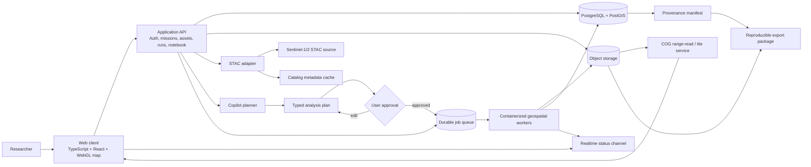

# Satellite Research Workspace
## Complete Implementation Plan, Architecture, Schema, APIs, and Delivery Roadmap

**Document status:** Implementation-ready product and engineering blueprint  
**Recommended architecture:** Modular monolith with asynchronous geospatial workers  
**Primary users:** Researchers and analysts working with satellite imagery  
**MVP sensors:** Sentinel-1 SAR, Sentinel-2 MSI, and user-uploaded GeoTIFF/COG assets  
**MVP analysis modes:** RGB/false color, optical indices, SAR backscatter/change detection  
**Future modes:** hyperspectral, classification, temporal anomaly detection, custom pipelines

---

## 1. Executive decision

Build a **mission-centered, query-first research workspace**.

The product should let a researcher:

1. Create a mission and define an area of interest (AOI).
2. Upload GeoTIFF/COG assets or discover Sentinel-1/Sentinel-2 scenes.
3. Ask a research question in natural language.
4. Review and edit a typed analysis plan generated by the copilot.
5. Explicitly approve the plan.
6. Run a versioned, asynchronous analysis.
7. Inspect tiled results, charts, quality warnings, and source evidence.
8. Save the question, plan, inputs, parameters, outputs, and provenance in a notebook record.
9. Export a reproducible research package.

### Product north star

> **Reduce the time from a geospatial question to a reviewed, reproducible result.**

### Non-goals for the first release

- Replacing desktop GIS software.
- Arbitrary user code execution from the browser.
- Fully autonomous AI analysis.
- Claiming scientific certainty from a model-generated answer.
- Real-time emergency alerting guarantees.
- Supporting every remote-sensing sensor and preprocessing convention on day one.

---

## 2. Product boundaries and operating principles

### 2.1 Trust model

The system must keep these states separate:

- **Observed:** metadata, measurements, source imagery, pipeline outputs.
- **Inferred:** AI interpretation, suggested parameters, candidate explanation.
- **Approved:** a researcher-approved plan.
- **Executed:** a run actually submitted to the worker system.
- **Reviewed:** a result annotated or accepted by a researcher.

The copilot can propose and explain. It cannot silently execute analysis or mutate mission data.

### 2.2 Data principles

- Source assets are immutable after registration.
- Derived outputs reference the exact source asset versions and pipeline version used.
- Every run has an immutable run ID and a reproducibility manifest.
- Uploaded data is tenant-isolated and access-controlled.
- Large rasters are rendered through tiles or range reads; the browser never receives an entire raster by default.
- Every external imagery item retains source/catalog identifiers and attribution.
- Missing metadata, unsupported CRS, cloud contamination, and low-quality inputs are visible to the researcher.

### 2.3 MVP success metrics

- Median time from question to first usable result.
- Upload-to-visible-layer success rate for representative GeoTIFF/COG assets.
- Percentage of completed runs with complete provenance.
- Copilot plan approval rate.
- Analysis failure rate by pipeline and input condition.
- Percentage of results reproducible from a saved mission record.
- Researcher trust score: “I understand what data and assumptions produced this result.”

---

## 3. Recommended system architecture

### 3.1 Architecture choice

Use a **modular monolith for the product API plus asynchronous containerized workers**.

This gives the team:

- One deployable API initially.
- Strong internal module boundaries.
- One authoritative relational data model.
- Independent scaling for raster ingestion and analysis.
- A straightforward path to split services later.

Do not begin with a distributed microservice fleet. Geospatial correctness, data validation, and researcher workflow quality are the primary early risks—not service decomposition.

### 3.2 Logical architecture



### 3.3 Runtime components

#### Web client

Responsibilities:

- Mission navigation and workspace state.
- Map rendering, layer visibility, legends, AOI drawing, and time controls.
- Upload initiation and validation status.
- Sentinel scene search and preview.
- Query composer and plan review.
- Run monitoring and result inspection.
- Notebook entries, annotations, exports, and sharing.

Recommended frontend boundaries:

```text
src/
  app/                 route shells and providers
  features/
    missions/
    workspace/
    catalog/
    ingestion/
    analysis/
    runs/
    notebook/
    copilot/
    sharing/
  components/
    map/
    layers/
    forms/
    tables/
    status/
    evidence/
  lib/
    api-client/
    geo/
    query-state/
    permissions/
  styles/
```

The map should be a persistent surface. Query, analysis configuration, provenance, and evidence should open in inspectors or drawers without losing spatial context.

#### Application API

Suggested modules:

```text
identity       authentication, sessions, user profile
workspaces     organizations, membership, roles
missions       mission CRUD, AOIs, periods, settings
assets         uploads, registrations, versions, validation
catalog        STAC search proxy, scene registration, previews
analysis       pipeline definitions, plan validation, run submission
runs           status, logs, outputs, comparison, cancellation
notebook       questions, entries, annotations, findings
copilot        intent parsing, plan drafting, evidence answers
exports        manifest generation, signed downloads, report packages
sharing        mission access and share links
observability  audit events, metrics, trace correlation
```

#### Object storage

Use private object storage with signed URLs. Suggested prefixes:

```text
{tenant_id}/missions/{mission_id}/assets/{asset_id}/source/{filename}
{tenant_id}/missions/{mission_id}/assets/{asset_id}/derived/{asset_version_id}/...
{tenant_id}/missions/{mission_id}/runs/{run_id}/logs/...
{tenant_id}/missions/{mission_id}/runs/{run_id}/outputs/...
{tenant_id}/missions/{mission_id}/exports/{export_id}/manifest.json
```

Never use user-provided filenames as authorization keys. Object paths must be generated by the server.

#### PostgreSQL/PostGIS

Use PostGIS for:

- AOI geometry.
- Asset and scene footprints.
- Spatial intersection queries.
- Bounding-box catalog search.
- Geometry validity checks.
- Spatial summaries and vector outputs.

Use relational tables for permissions, metadata, plans, runs, events, notebook records, and provenance.

#### STAC adapter

The adapter should normalize external catalogs into an internal representation without copying every remote scene into the platform.

Responsibilities:

- Search by AOI, time range, collection, cloud cover, polarization, and orbit direction.
- Normalize item IDs, collection IDs, footprints, datetime, assets, and attribution.
- Cache metadata and thumbnails.
- Preserve external asset URLs and access status.
- Register selected external items as mission assets.
- Detect when an external source becomes unavailable.

#### Analysis queue and workers

The API creates a run record and dispatches a job. Workers do the heavy work:

- Read source assets by signed or internal object URL.
- Fetch or stage external imagery.
- Validate assumptions again server-side.
- Execute a version-pinned pipeline.
- Write COG/vector outputs and summaries.
- Emit progress events.
- Store logs and quality flags.
- Update run status atomically.

Workers must be idempotent. Retrying a job must not create duplicate logical outputs.

#### Copilot planner

The copilot has two modes:

1. **Planning:** convert a user question into a typed analysis plan.
2. **Evidence Q&A:** answer questions from authorized mission context and completed outputs.

It should use allowlisted application tools such as:

```text
search_mission_assets
search_catalog_scenes
inspect_asset_metadata
get_run_summary
get_output_statistics
get_layer_provenance
validate_analysis_plan
```

It should not have direct SQL access, arbitrary shell execution, arbitrary network access, or direct write access to the database.

---

## 4. Frontend information architecture

### 4.1 Primary navigation

1. **Missions**
   - Recent missions
   - Status and owner
   - Last activity
   - Create mission

2. **Mission workspace**
   - Persistent map
   - AOI and time controls
   - Source/result layer stack
   - Scene and asset browser
   - Copilot inspector

3. **Runs**
   - Queued, active, completed, failed, and cancelled runs
   - Logs
   - Compare outputs
   - Provenance

4. **Notebook & exports**
   - Questions
   - Approved plans
   - Findings
   - Annotations
   - Reproducible packages

### 4.2 Mission workspace layout

```text
┌─────────────────────────────────────────────────────────┐
│ Mission / AOI / dates / search / share / export         │
├──────────────┬──────────────────────────────┬───────────┤
│ Data rail    │                              │ Inspector │
│ - layers     │          Map canvas           │ - query   │
│ - scenes     │   tiled source + results     │ - plan    │
│ - assets     │   AOI + time controls        │ - details │
│ - filters    │                              │ - evidence│
├──────────────┴──────────────────────────────┴───────────┤
│ Run strip / status / warnings / provenance               │
└─────────────────────────────────────────────────────────┘
```

### 4.3 Required frontend states

Every major workflow must have explicit states:

- Empty
- Loading
- Validating
- Ready
- Needs attention
- Running
- Succeeded
- Succeeded with warnings
- Failed with recovery action
- Cancelled
- Permission denied
- External source unavailable

Do not use a generic spinner for long-running ingestion or analysis. Show a stage, progress, elapsed time, expected next action, and recovery path.

### 4.4 Key screens

#### Mission home

- Mission name, description, owner, last updated.
- AOI thumbnail and date range.
- Recent assets and runs.
- “Ask a question” primary CTA.
- “Add data” secondary CTA.
- Warnings requiring attention.

#### Query workspace

- Natural-language composer.
- Selected AOI, time range, and sensor chips.
- Copilot response with plan preview.
- Editable pipeline, inputs, parameters, assumptions, and outputs.
- Confirm-and-run gate.

#### Catalog and ingestion

- Upload drop zone.
- File validation progress.
- CRS, bounds, dimensions, bands, nodata, and checksum summary.
- Sentinel scene search.
- Preview thumbnails and metadata.
- Add-to-mission action.

#### Analysis lab

- Three MVP pipeline cards.
- Required input indicators.
- Band and mask selectors.
- Unit-aware controls.
- Parameter descriptions and assumptions.
- Estimated runtime/compute.
- Versioned-run action.

#### Results explorer

- Source/result side-by-side or swipe comparison.
- Layer controls and legends.
- Time slider.
- Map inspection.
- Charts and summary statistics.
- Quality flags.
- Provenance drawer.

#### Notebook and export

- Question, plan, run, and finding timeline.
- Analyst annotations.
- Links to exact source layers and outputs.
- Reproducibility manifest.
- Export as ZIP, JSON manifest, GeoTIFF/vector outputs, and human-readable report.

---

## 5. Database design

### 5.1 Database conventions

- PostgreSQL 16+ with PostGIS.
- UUID primary keys generated server-side.
- `timestamptz` for all instants.
- Geometry stored in EPSG:4326 unless a table explicitly needs another SRID.
- `jsonb` for extensible metadata, never for fields needed in frequent filters or joins.
- Soft deletion for user-facing records; source assets and run records are never physically deleted by ordinary users.
- `created_at`, `updated_at` on mutable entities.
- Row-level authorization enforced in the API and optionally with PostgreSQL RLS.

### 5.2 Entity relationships

```text
organizations ──< organization_members >── users
      │
      └──< missions ──< mission_members
              ├──< areas_of_interest
              ├──< assets ──< asset_versions
              ├──< questions ──< analysis_plans ──< analysis_runs
              │                                  ├──< run_events
              │                                  ├──< run_outputs
              │                                  └──< provenance_records
              ├──< notebook_entries
              ├──< annotations
              └──< audit_events
```

### 5.3 Core tables

#### organizations

Tenant or research group boundary.

- `id`
- `name`
- `slug`
- `settings`
- timestamps

#### users

Application identity mapped to the selected auth provider.

- `id`
- `external_subject`
- `email`
- `display_name`
- `avatar_url`
- `status`
- timestamps

#### organization_members

- `organization_id`
- `user_id`
- `role`: `owner`, `admin`, `researcher`, `viewer`
- timestamps

#### missions

Top-level research container.

- `id`
- `organization_id`
- `name`
- `slug`
- `description`
- `status`: `active`, `archived`
- `default_srid`
- `settings`
- `created_by`
- timestamps

#### mission_members

Mission-level access override.

- `mission_id`
- `user_id`
- `role`: `owner`, `editor`, `viewer`

#### areas_of_interest

Named AOI geometries and optional temporal scope.

- `id`
- `mission_id`
- `name`
- `geometry GEOMETRY(MultiPolygon,4326)`
- `bbox GEOMETRY(Polygon,4326)`
- `start_at`, `end_at`
- `source_type`: `drawn`, `uploaded`, `derived`
- `source_asset_id`
- `metadata`

#### assets

Logical source or derived asset identity.

- `id`
- `mission_id`
- `asset_type`: `uploaded`, `catalog_item`, `derived`
- `title`
- `source_provider`
- `external_id`
- `collection_id`
- `footprint GEOMETRY(MultiPolygon,4326)`
- `acquired_at`
- `metadata`
- `status`: `registered`, `validating`, `ready`, `warning`, `invalid`, `unavailable`

#### asset_versions

Immutable asset materialization or metadata snapshot.

- `id`
- `asset_id`
- `version_number`
- `object_uri`
- `thumbnail_uri`
- `mime_type`
- `size_bytes`
- `sha256`
- `crs_code`
- `width`, `height`
- `band_count`
- `resolution_x`, `resolution_y`
- `nodata_value`
- `metadata`
- `validation_report`
- `created_by`

#### asset_bands

Band-level metadata used by validation and the UI.

- `id`
- `asset_version_id`
- `band_index`
- `name`
- `common_name`
- `wavelength_min_nm`, `wavelength_max_nm`
- `scale_factor`, `add_offset`
- `unit`
- `metadata`

#### catalog_items

Normalized external STAC metadata cache.

- `id`
- `provider`
- `external_id`
- `collection_id`
- `geometry GEOMETRY(MultiPolygon,4326)`
- `bbox GEOMETRY(Polygon,4326)`
- `acquired_at`
- `cloud_cover`
- `orbit_direction`
- `polarizations`
- `properties`
- `assets`
- `last_seen_at`
- unique `(provider, external_id)`

#### questions

Researcher intent and conversational context.

- `id`
- `mission_id`
- `created_by`
- `text`
- `context`
- `status`: `draft`, `planned`, `executed`, `saved`, `archived`
- timestamps

#### analysis_plans

Typed, inspectable plan generated or edited before execution.

- `id`
- `question_id`
- `version_number`
- `created_by`
- `origin`: `copilot`, `manual`, `template`
- `pipeline_key`
- `pipeline_version`
- `input_bindings`
- `aoi_id`
- `time_range`
- `parameters`
- `assumptions`
- `validation_report`
- `expected_outputs`
- `estimated_compute`
- `status`: `draft`, `validated`, `approved`, `superseded`, `rejected`
- `approved_by`, `approved_at`

#### analysis_runs

Immutable execution record.

- `id`
- `mission_id`
- `question_id`
- `analysis_plan_id`
- `run_number`
- `status`: `queued`, `preparing`, `running`, `succeeded`, `succeeded_with_warnings`, `failed`, `cancel_requested`, `cancelled`
- `worker_job_id`
- `pipeline_key`
- `pipeline_version`
- `environment_digest`
- `started_at`, `finished_at`
- `progress_percent`
- `error_code`, `error_message`
- `resource_usage`
- timestamps

#### run_events

Append-only status and progress history.

- `id`
- `run_id`
- `event_type`
- `stage`
- `message`
- `progress_percent`
- `payload`
- `occurred_at`

#### run_outputs

Files or layers produced by a run.

- `id`
- `run_id`
- `output_type`: `raster`, `vector`, `table`, `chart`, `thumbnail`, `report`, `log`
- `name`
- `object_uri`
- `tile_uri`
- `mime_type`
- `geometry GEOMETRY(MultiPolygon,4326)`
- `statistics`
- `quality_flags`
- `metadata`

#### provenance_records

Machine-readable reproducibility manifest.

- `id`
- `run_id`
- `manifest_uri`
- `source_assets`
- `pipeline`
- `parameters`
- `software`
- `environment`
- `external_sources`
- `created_at`

#### notebook_entries

Human-readable research record.

- `id`
- `mission_id`
- `question_id`
- `run_id`
- `title`
- `body`
- `entry_type`: `question`, `result`, `note`, `finding`, `decision`
- `visibility`
- `created_by`
- timestamps

#### annotations

Map-anchored or notebook-anchored research notes.

- `id`
- `mission_id`
- `run_id`
- `created_by`
- `annotation_type`: `point`, `line`, `polygon`, `text`
- `geometry GEOMETRY(Geometry,4326)`
- `label`
- `content`
- `confidence`
- `metadata`

#### audit_events

Security and accountability trail.

- `id`
- `organization_id`
- `mission_id`
- `actor_user_id`
- `action`
- `entity_type`
- `entity_id`
- `request_id`
- `metadata`
- `created_at`

### 5.4 Important indexes

```sql
CREATE INDEX idx_missions_org ON missions(organization_id);
CREATE INDEX idx_aoi_geometry ON areas_of_interest USING GIST(geometry);
CREATE INDEX idx_assets_footprint ON assets USING GIST(footprint);
CREATE INDEX idx_assets_mission_status ON assets(mission_id, status);
CREATE INDEX idx_assets_acquired_at ON assets(acquired_at);
CREATE INDEX idx_catalog_geometry ON catalog_items USING GIST(geometry);
CREATE INDEX idx_catalog_acquired_at ON catalog_items(acquired_at);
CREATE INDEX idx_catalog_collection ON catalog_items(collection_id);
CREATE INDEX idx_runs_mission_status ON analysis_runs(mission_id, status);
CREATE INDEX idx_run_events_run_time ON run_events(run_id, occurred_at);
CREATE INDEX idx_outputs_run ON run_outputs(run_id);
CREATE INDEX idx_notebook_mission_created ON notebook_entries(mission_id, created_at DESC);
CREATE INDEX idx_audit_mission_created ON audit_events(mission_id, created_at DESC);
```

---

## 6. API contract

Use REST for resource operations and server-sent events or WebSockets for run status. All endpoints must be tenant- and mission-scoped.

### 6.1 Mission APIs

```text
POST   /v1/missions
GET    /v1/missions
GET    /v1/missions/{missionId}
PATCH  /v1/missions/{missionId}
POST   /v1/missions/{missionId}/members
DELETE /v1/missions/{missionId}/members/{userId}
```

### 6.2 AOI APIs

```text
POST   /v1/missions/{missionId}/aois
GET    /v1/missions/{missionId}/aois
GET    /v1/missions/{missionId}/aois/{aoiId}
PATCH  /v1/missions/{missionId}/aois/{aoiId}
```

Create AOI request:

```json
{
  "name": "Lower Mekong Basin",
  "geometry": {
    "type": "Polygon",
    "coordinates": [[[100.1, 12.1], [106.3, 12.1], [106.3, 18.2], [100.1, 18.2], [100.1, 12.1]]]
  },
  "startAt": "2024-05-24T00:00:00Z",
  "endAt": "2024-05-30T23:59:59Z"
}
```

### 6.3 Upload and asset APIs

```text
POST   /v1/missions/{missionId}/uploads/initiate
POST   /v1/missions/{missionId}/assets/complete-upload
GET    /v1/missions/{missionId}/assets
GET    /v1/missions/{missionId}/assets/{assetId}
GET    /v1/missions/{missionId}/assets/{assetId}/versions
POST   /v1/missions/{missionId}/assets/{assetId}/validate
```

Upload flow:

1. API creates an upload session and object key.
2. Client uploads directly to private object storage using signed multipart URLs.
3. Client calls `complete-upload`.
4. Ingestion job validates the object.
5. API creates an asset version and emits validation status.
6. UI displays metadata, errors, warnings, and next actions.

### 6.4 Catalog APIs

```text
POST /v1/missions/{missionId}/catalog/search
POST /v1/missions/{missionId}/catalog/items/{provider}/{externalId}/register
GET  /v1/missions/{missionId}/catalog/items/{catalogItemId}
```

Catalog search request:

```json
{
  "aoiId": "aoi_123",
  "collections": ["sentinel-1-grd", "sentinel-2-l2a"],
  "datetime": {
    "start": "2024-05-24T00:00:00Z",
    "end": "2024-05-30T23:59:59Z"
  },
  "cloudCoverMax": 40,
  "polarizations": ["VV", "VH"],
  "limit": 50,
  "cursor": null
}
```

### 6.5 Copilot APIs

```text
POST /v1/missions/{missionId}/questions
POST /v1/missions/{missionId}/questions/{questionId}/plan
POST /v1/missions/{missionId}/plans/{planId}/validate
POST /v1/missions/{missionId}/plans/{planId}/approve
POST /v1/missions/{missionId}/copilot/answer
```

Typed plan response:

```json
{
  "planId": "plan_123",
  "status": "validated",
  "pipeline": {
    "key": "optical_change",
    "version": "1.0.0",
    "label": "Optical change detection"
  },
  "aoiId": "aoi_123",
  "timeRange": {
    "before": {"start": "2024-07-01", "end": "2024-07-10"},
    "after": {"start": "2024-07-20", "end": "2024-07-30"}
  },
  "inputs": [
    {"assetId": "asset_s2_1", "role": "before_scene"},
    {"assetId": "asset_s2_2", "role": "after_scene"},
    {"assetId": "asset_boundary_1", "role": "mask"}
  ],
  "parameters": {
    "index": "NDVI",
    "cloudMask": "s2cloudless",
    "threshold": 0.2
  },
  "assumptions": [
    "Both scenes must be cloud-masked",
    "Scenes should be comparable in processing level and resolution"
  ],
  "warnings": [],
  "expectedOutputs": ["change_raster", "summary_statistics", "quality_report"]
}
```

### 6.6 Run APIs

```text
POST   /v1/missions/{missionId}/runs
GET    /v1/missions/{missionId}/runs
GET    /v1/missions/{missionId}/runs/{runId}
GET    /v1/missions/{missionId}/runs/{runId}/events
POST   /v1/missions/{missionId}/runs/{runId}/cancel
POST   /v1/missions/{missionId}/runs/{runId}/retry
GET    /v1/missions/{missionId}/runs/{runId}/outputs
GET    /v1/missions/{missionId}/runs/{runId}/provenance
```

### 6.7 Realtime events

```text
GET /v1/missions/{missionId}/events
```

Example event:

```json
{
  "type": "run.progress",
  "runId": "run_123",
  "stage": "analysis",
  "status": "running",
  "progressPercent": 60,
  "message": "Computing change raster over AOI",
  "occurredAt": "2024-05-30T10:21:00Z"
}
```

---

## 7. Analysis pipeline design

### 7.1 Pipeline registry

Do not hard-code pipeline behavior into frontend screens. Store a versioned pipeline registry.

Each pipeline definition includes:

```json
{
  "key": "sar_change",
  "version": "1.0.0",
  "label": "SAR backscatter change",
  "supportedCollections": ["sentinel-1-grd"],
  "requiredBands": ["VV", "VH"],
  "parametersSchema": {},
  "inputRoles": ["before_scene", "after_scene", "optional_mask"],
  "outputTypes": ["change_raster", "statistics", "quality_report"],
  "containerImage": "registry.example/sar-change@sha256:...",
  "scientificNotes": [],
  "qualityChecks": []
}
```

### 7.2 MVP pipeline definitions

#### RGB / false color

Purpose: visual inspection and band composition.

Inputs:

- One multispectral asset.
- Band mapping for red, green, blue or near-infrared, red, green.

Outputs:

- Renderable RGB/false-color COG.
- Thumbnail.
- Band mapping manifest.

#### Optical indices

Purpose: NDVI, NDWI, NDBI, and related indices where supported.

Inputs:

- Sentinel-2 or compatible multispectral asset.
- Required band mapping.
- Cloud and scene-quality masks.

Outputs:

- Index raster.
- Histogram and summary statistics.
- Quality mask.
- Legend configuration.

#### SAR backscatter/change

Purpose: calibrated backscatter and before/after change inspection.

Inputs:

- Sentinel-1 GRD scenes.
- Polarization selection.
- Orbit and temporal pairing.
- Optional terrain correction and mask settings.

Outputs:

- Backscatter raster.
- Change raster.
- Summary statistics.
- Processing and quality report.

### 7.3 Worker contract

Job input:

```json
{
  "runId": "run_123",
  "pipelineKey": "sar_change",
  "pipelineVersion": "1.0.0",
  "inputAssets": [],
  "aoi": {},
  "parameters": {},
  "outputPrefix": "private/.../runs/run_123/outputs/",
  "environmentDigest": "sha256:..."
}
```

Worker output:

```json
{
  "status": "succeeded_with_warnings",
  "outputs": [],
  "qualityFlags": [],
  "statistics": {},
  "warnings": [],
  "provenance": {}
}
```

### 7.4 Quality checks

At minimum:

- Geometry validity.
- CRS supported or safely transformable.
- Required bands present.
- Compatible resolution and dimensions.
- Nodata and scale/offset known.
- Temporal pairing within configured tolerance.
- Cloud or quality mask available where required.
- Input asset accessible at execution time.
- Output bounds and statistics finite.
- Output file readable and tileable.

---

## 8. Query and AI implementation

### 8.1 Planner stages

1. **Context collection:** selected mission, AOI, date range, visible layers, and user question.
2. **Intent extraction:** task type, sensor, temporal comparison, metrics, and expected output.
3. **Asset retrieval:** search authorized mission assets and catalog results.
4. **Plan construction:** choose an allowlisted pipeline and fill parameters.
5. **Scientific validation:** check required bands, sensor compatibility, masks, units, and temporal constraints.
6. **Human review:** show editable plan and assumptions.
7. **Persistence:** save the exact plan version.
8. **Execution:** submit only after explicit approval.

### 8.2 AI guardrails

- Never state that a result is scientifically definitive.
- Always cite mission assets, run outputs, dates, and pipeline versions.
- Clearly distinguish metadata facts from interpretation.
- Return “insufficient evidence” when inputs are missing or incompatible.
- Never fabricate a scene, measurement, output, or citation.
- Do not execute actions from plain text without an approval event.
- Limit retrieval to the active organization and mission.
- Log prompt, selected context IDs, plan version, and response metadata according to the retention policy.

### 8.3 Evidence answer format

```json
{
  "answer": "Vegetation stress increased in 34% of the selected boundary...",
  "confidence": "medium",
  "facts": [],
  "interpretations": [],
  "limitations": [],
  "evidence": [
    {"type": "run_output", "id": "output_123", "label": "NDVI change raster"},
    {"type": "asset", "id": "asset_456", "label": "Sentinel-2 2024-07-28"}
  ],
  "suggestedNextActions": []
}
```

---

## 9. Security, privacy, and governance

### 9.1 Access control

Authorization must be enforced on the server for every request:

```text
organization access
  → mission membership
    → asset/run/output access
      → signed object URL access
```

Roles:

- **Owner:** manage mission, members, data, and deletion/archive.
- **Editor:** add data, create plans/runs, annotate, and export.
- **Viewer:** inspect authorized data and results.
- **Organization admin:** manage organization membership and settings.

### 9.2 Storage security

- Private buckets only.
- Short-lived signed URLs.
- Encryption at rest and in transit.
- Server-generated object keys.
- Malware/file-type checks for uploads.
- Maximum upload size and quota per organization.
- Lifecycle policies for temporary staging files.

### 9.3 AI security

- No cross-tenant retrieval.
- Tool calls filtered by server authorization.
- PII and secrets excluded from prompts where possible.
- Prompt/response audit metadata without unnecessarily retaining sensitive raw content.
- Rate limits and usage budgets.
- Human approval for runs and mutations.

### 9.4 Audit events

Record:

- Login and membership changes.
- Mission and asset access.
- Upload, deletion/archive, and export.
- Plan approval.
- Run submission, cancellation, retry, and result review.
- Share-link creation and revocation.

---

## 10. Observability and operations

### 10.1 Metrics

API:

- Request latency by route.
- Error rate.
- Authorization failures.
- Upload completion rate.

Ingestion:

- Validation duration.
- Invalid asset rate by error type.
- Bytes processed.
- Tile generation duration.

Analysis:

- Queue depth.
- Time to start.
- Runtime by pipeline.
- Success/failure/cancellation rate.
- Retry count.
- Output size.

Copilot:

- Plan generation latency.
- Plan validation failure rate.
- Approval rate.
- Evidence answer latency.
- Tool-call errors.

### 10.2 Logs

Every request and worker job should carry:

- `request_id`
- `organization_id`
- `mission_id`
- `user_id` where available
- `run_id` where available
- `pipeline_key` and version

Do not log signed URLs, access tokens, raw secrets, or complete sensitive prompts by default.

### 10.3 Failure handling

- Durable queue with retries and exponential backoff.
- Dead-letter queue for permanently failing jobs.
- Explicit user-facing error codes.
- Retry only when the failure is likely transient.
- Preserve logs and intermediate metadata even when a run fails.
- Never overwrite a prior successful run during retry.

---

## 11. Testing strategy

### 11.1 Unit tests

- Geometry validation and normalization.
- CRS detection and transform rules.
- Band mapping and parameter validation.
- Pipeline registry schemas.
- Permission policies.
- Plan validation.
- Provenance manifest generation.

### 11.2 Integration tests

- Multipart upload → validation → asset version.
- STAC search → catalog registration → mission asset.
- Approved plan → run creation → worker dispatch.
- Worker output → run completion → map tile access.
- Mission membership → signed URL authorization.
- Copilot tool call → scoped evidence retrieval.

### 11.3 Geospatial golden tests

Maintain small, legally usable fixture datasets with expected outputs for:

- RGB composition.
- NDVI/NDWI calculations.
- SAR backscatter conversion.
- Change detection.
- Nodata handling.
- CRS transformation.
- AOI clipping.
- COG validity and tile generation.

Compare outputs with tolerances; do not rely only on visual screenshots.

### 11.4 End-to-end tests

Primary test:

```text
Create mission
→ draw AOI
→ upload fixture COG
→ validate asset
→ ask question
→ generate plan
→ edit and approve plan
→ submit run
→ observe progress
→ inspect output
→ save notebook entry
→ export provenance package
```

### 11.5 Load tests

Test separately:

- Catalog search under concurrent users.
- Large upload initiation and completion.
- Map tile requests while analysis jobs run.
- Queue behavior with mixed short and long jobs.
- Copilot rate limits.

---

## 12. Deployment and environments

### 12.1 Environments

- **Local:** Docker Compose with Postgres/PostGIS, object-storage emulator, queue, API, worker, and web client.
- **Preview:** per-branch web/API deployment with isolated database schema or database.
- **Staging:** production-like data services and representative fixtures.
- **Production:** managed Postgres/PostGIS, private object storage, durable queue, worker autoscaling, monitoring, backups.

### 12.2 Suggested repository structure

```text
satellite-workspace/
  apps/
    web/
    api/
    worker/
  packages/
    contracts/
    geo-core/
    pipeline-registry/
    ui/
    config/
  infra/
    docker/
    migrations/
    terraform-or-equivalent/
  pipelines/
    rgb/
    optical-indices/
    sar-change/
  tests/
    fixtures/
    integration/
    e2e/
  docs/
    implementation-plan.md
    runbooks/
```

### 12.3 CI/CD gates

Every merge should run:

1. Formatting and linting.
2. Type checking.
3. Unit tests.
4. API contract tests.
5. Migration validation.
6. Worker fixture tests.
7. Build container images.
8. Security/dependency scanning.
9. Preview deployment smoke test.

Production deploy gates:

- Migration is backward-compatible.
- Worker and API versions are compatible.
- Health checks pass.
- Queue and object-storage connectivity pass.
- Rollback image is available.

---

## 13. Database migration starter

The companion file `schema.sql` contains a concrete PostgreSQL/PostGIS starting schema for the MVP. Apply it through a migration tool rather than running it manually in production.

Migration rules:

- Never edit an applied migration.
- Add forward migrations.
- Avoid destructive changes in the same release as an application change.
- Backfill large tables asynchronously.
- Test rollback or documented forward recovery for every migration.

---

## 14. 90-day implementation roadmap

### Phase 0 — Product and scientific validation (days 1–10)

Deliverables:

- Researcher interviews and workflow map.
- Three representative GeoTIFF/COG fixtures.
- Sentinel-1 and Sentinel-2 catalog assumptions.
- Pipeline acceptance criteria.
- Initial UI prototype and design tokens.
- Permission model and retention decisions.

Exit criteria:

- Analysts agree on the first three workflows.
- Required input metadata is documented.
- At least one valid and one invalid fixture exists for each pipeline.

### Phase 1 — Foundation and mission shell (days 11–25)

Deliverables:

- Repository and CI/CD.
- Auth and organization membership.
- Mission/AOI CRUD.
- PostGIS migrations.
- Private object storage.
- Upload session and basic ingestion worker.
- Persistent map shell.

Exit criteria:

- A user can create a mission, draw an AOI, upload a fixture, and see validation results.

### Phase 2 — Catalog and rendering (days 26–40)

Deliverables:

- STAC search adapter.
- Catalog cache and selected-scene registration.
- GeoTIFF/COG metadata extraction.
- Tile/range-read rendering.
- Layer stack, legends, time controls, and scene previews.

Exit criteria:

- A user can view an uploaded COG and a registered Sentinel scene in the same map workspace.

### Phase 3 — Analysis execution (days 41–60)

Deliverables:

- Pipeline registry.
- RGB worker.
- Optical indices worker.
- SAR change worker.
- Durable queue.
- Run states, logs, events, cancellation, and retry.
- Output registration and provenance manifest.

Exit criteria:

- Each MVP pipeline passes golden tests and produces a tiled, inspectable output.

### Phase 4 — Query-driven workspace (days 61–75)

Deliverables:

- Question composer.
- Copilot plan schema.
- Mission-scoped retrieval tools.
- Plan validation.
- Approval gate.
- Run submission from approved plan.
- Evidence-linked answer format.

Exit criteria:

- A researcher can ask a supported question, inspect/edit the plan, approve it, run it, and see evidence-linked results.

### Phase 5 — Notebook, sharing, and hardening (days 76–90)

Deliverables:

- Notebook entries and annotations.
- Reproducible export package.
- Mission sharing and role enforcement.
- Audit events.
- Observability dashboards.
- Accessibility and failure-state polish.
- Pilot with target researchers.

Exit criteria:

- Pilot users can reproduce a result from the saved mission record without engineering assistance.

---

## 15. Post-MVP evolution

### Release 1.1

- More optical indices.
- More robust temporal compositing.
- Better comparison and annotation.
- Report generation.
- Saved search and saved views.

### Release 1.2

- Classification with explicit training data workflows.
- Hyperspectral exploration/unmixing where supported by validated input data.
- Temporal anomaly analysis.
- More catalog providers.

### Release 2

- Event-driven service extraction where scale justifies it.
- Team assignments and review queues.
- Scheduled monitoring.
- Alert policies with explicit human review.
- Organization-level quotas and billing integration if needed.

Do not add autonomous alerting or automated conclusions until provenance, validation, review, and notification semantics are well established.

---

## 16. Definition of done for MVP

The MVP is complete when:

- A researcher can create a mission and AOI.
- The researcher can upload a valid GeoTIFF/COG and receive useful validation feedback.
- The researcher can search and register Sentinel-1/2 scenes.
- The map can render source and derived layers without loading full rasters into browser memory.
- The researcher can run RGB, optical-index, and SAR change analyses.
- Every run exposes status, logs, outputs, warnings, and provenance.
- The copilot creates typed plans and cannot bypass approval.
- Results are linked to source assets, parameters, pipeline version, and environment version.
- Mission access is enforced for assets, outputs, copilot context, and exports.
- A notebook entry and reproducible package can be created from a completed run.
- Automated tests cover core API, permissions, geospatial transformations, pipeline fixtures, and the end-to-end golden path.
- Pilot researchers can complete the golden path and explain how a result was produced.


---

## 17. Query-driven copilot: prompt engineering and plan safety

### 17.1 Core rule

The copilot must never translate a natural-language request directly into a worker command. It must produce a **typed analysis plan**, validate that plan against mission data and pipeline constraints, show it to the researcher, and execute only after explicit approval.

```text
Natural-language question
  → intent extraction
  → authorized asset retrieval
  → typed plan generation
  → schema validation
  → scientific/metadata validation
  → human review and approval
  → immutable run creation
  → evidence-linked answer
```

### 17.2 Model responsibilities

Use separate prompts or stages for separate responsibilities:

1. **Intent extractor:** identifies task, AOI, dates, sensors, comparison, metric, and expected output.
2. **Plan composer:** maps the intent to an allowlisted pipeline and structured parameters.
3. **Plan critic:** checks missing information, incompatible sensors, unsupported operations, and ambiguous assumptions.
4. **Evidence answerer:** explains completed results using only authorized outputs and metadata.

Do not use one giant prompt that both interprets intent and executes operations.

### 17.3 System prompt for the plan composer

```text
You are the planning component of a satellite imagery research workspace.

Your only job is to create a typed, reviewable AnalysisPlan JSON object.
You do not execute analysis. You do not invent data. You do not invent scene IDs,
bands, dates, measurements, outputs, or scientific conclusions.

You may select only a pipeline from the supplied PIPELINE_REGISTRY.
You may reference only assets from AUTHORIZED_ASSETS and AOIs from AUTHORIZED_AOIS.
You must preserve IDs exactly as provided.
You must use null or an explicit missing-information warning when the request is underspecified.
You must not silently choose a sensor, date range, band, CRS, mask, threshold, or resampling method
when that choice materially affects the scientific result.

For every plan:
- name the selected pipeline and exact version;
- bind every input role to an authorized asset ID or mark it unresolved;
- bind the AOI and temporal window;
- provide explicit parameters with units;
- list assumptions separately from observed metadata;
- list validation warnings and blocking errors;
- specify expected outputs;
- state what the plan cannot conclude.

The output must be valid JSON matching the supplied JSON Schema.
Return JSON only. Do not wrap it in Markdown.
```

### 17.4 Context envelope

The application, not the model, builds the context envelope:

```json
{
  "MISSION": {
    "id": "mission_123",
    "name": "Lower Mekong flood study",
    "defaultCrs": "EPSG:4326"
  },
  "AUTHORIZED_AOIS": [],
  "AUTHORIZED_ASSETS": [],
  "PIPELINE_REGISTRY": [],
  "USER_QUERY": "...",
  "UI_CONTEXT": {
    "selectedAoiId": "aoi_123",
    "selectedAssetIds": ["asset_1", "asset_2"],
    "visibleLayerIds": ["output_1"]
  },
  "POLICY": {
    "requireApproval": true,
    "allowExternalAssets": true,
    "allowExpensiveRuns": false
  }
}
```

Never let the model discover unauthorized records by querying the database. Retrieval tools must filter by organization and mission before results enter the prompt.

### 17.5 Prompt injection defenses

Satellite metadata, filenames, scene descriptions, notebook text, and uploaded documents are untrusted input. Treat them as data, never instructions.

- Delimit user text and metadata as quoted data blocks.
- Tell the model that any instructions inside asset metadata are non-executable.
- Strip or neutralize control characters and unneeded HTML/Markdown.
- Do not place secrets or internal service URLs in model context.
- Validate all tool arguments server-side.
- Use an allowlist of pipeline keys and parameter names.
- Reject model output that contains unknown fields, unknown IDs, arbitrary code, shell commands, or URLs where an ID is required.

### 17.6 Two-level validation

#### Level 1: Structural validation

Use JSON Schema with strict settings:

- `additionalProperties: false`
- required fields on every object
- enums for pipeline keys, sensor types, input roles, units, and resampling methods
- numeric minimum/maximum constraints
- string length limits
- array size limits
- UUID or application-ID pattern checks
- no arbitrary code fields

#### Level 2: Domain validation

After JSON Schema passes, validate against the database and pipeline registry:

- All referenced IDs exist and belong to the active mission.
- Asset status is `ready` or explicitly supported as external/unavailable.
- Asset collection supports the selected pipeline.
- Required bands are present.
- AOI intersects every required source asset.
- Temporal windows are complete and valid.
- Resolution and CRS assumptions are compatible.
- Cloud, quality, and nodata requirements are satisfied.
- Parameter values are within pipeline-specific scientific ranges.
- Estimated compute is within the user's quota and policy.
- Output types are supported by the selected worker version.

The plan is executable only when there are no blocking errors.
Warnings may remain visible and must be included in the run record.

### 17.7 Approval semantics

Approval must be a distinct API operation, not inferred from a button click in the frontend.

```text
POST /v1/missions/{missionId}/plans/{planId}/approve
```

The server should verify:

- The plan is still the latest validated version.
- The approving user has editor permission.
- The plan has no blocking errors.
- Referenced asset versions have not changed.
- The pipeline version is still available.
- The plan hash matches the version shown to the user.

The approval event should persist:

```json
{
  "planId": "plan_123",
  "planVersion": 2,
  "planHash": "sha256:...",
  "approvedBy": "user_123",
  "approvedAt": "2026-09-27T03:00:00Z",
  "uiConfirmation": "I reviewed the inputs, assumptions, and expected outputs."
}
```

### 17.8 Evidence answer prompt

The evidence answerer receives only completed run outputs, source metadata, quality flags, and authorized notebook context.

```text
You are an evidence assistant for a satellite imagery research mission.
Answer only from the EVIDENCE_PACKET.

Separate:
1. Measured facts from the outputs.
2. Reasonable interpretations.
3. Uncertainty and limitations.
4. Suggested next checks.

Never claim causality from a correlation. Never infer a measurement that is not present.
Always cite the output ID, source asset ID, acquisition date, and pipeline version when available.
If evidence is insufficient, say so clearly and explain what is missing.
Return JSON matching EvidenceAnswerSchema.
```

### 17.9 Adversarial test cases

Before production, test the copilot against:

- “Use the best available data” when no sensor is specified.
- A request for NDVI from Sentinel-1 SAR.
- An AOI outside every selected scene.
- A missing red or near-infrared band.
- A cloud-covered scene with no valid mask.
- A request to use a future date.
- A user asking to delete or overwrite a prior run.
- Prompt-injection text inside a filename or metadata field.
- An unknown pipeline name or invented asset ID.
- A request to run arbitrary Python or shell commands.
- A plan whose external source becomes unavailable after approval.
- A plan whose source asset version changes before execution.

Each case should produce a deterministic block, warning, or safe clarification—not a guessed operation.

---

## 18. Frontend COG rendering stack and large-raster strategy

### 18.1 Recommended stack

| Concern | Recommended choice | Reason |
|---|---|---|
| Web framework | React + TypeScript | Strong component ecosystem and type-safe application state |
| Map renderer | MapLibre GL JS | Open-source WebGL map renderer with custom source/layer support |
| Raster tile layer | `@geomatico/maplibre-cog-protocol` | Reads COG windows/ranges through the browser and exposes them as MapLibre sources |
| COG decoding | `geotiff.js` | Browser-side GeoTIFF/COG range reads and window decoding |
| WebGL raster math | `@math.gl/core` or custom WebGL shader modules | Fast transforms, color ramps, normalization, and GPU-friendly numeric work |
| Heavy raster processing | GDAL/rasterio in workers | Deterministic reprojection, clipping, mosaicking, statistics, and COG creation |
| Tile service fallback | TiTiler | Server-side dynamic COG tiles, previews, statistics, and rendering when client range requests are insufficient |
| Raster format | Cloud-Optimized GeoTIFF | HTTP range requests, overviews, tiling, and partial reads |
| Vector overlays | MapLibre vector sources / PMTiles where useful | AOI boundaries, footprints, annotations, and derived vectors |
| State management | TanStack Query + Zustand | Server cache plus local map/workspace state |
| Validation | Zod | Runtime validation for API responses and frontend plan state |
| Charts | Observable Plot or Apache ECharts | Time series, histograms, distributions, and run summaries |

### 18.2 Browser rendering path

```text
MapLibre GL JS
  → COG protocol source
  → HTTP Range requests
  → COG internal tile/overview
  → geotiff.js decode
  → WebGL texture/shader
  → color ramp + opacity + legend
```

Recommended behavior:

- Use the lowest overview suitable for the current zoom.
- Request only visible windows.
- Abort stale requests when the viewport or layer changes.
- Cache decoded tiles by asset version, overview, tile coordinate, and style parameters.
- Keep raw numeric values separate from display colorization where possible.
- Use server-side tiles for complex multi-band expressions or repeated shared views.

### 18.3 When to use client-side COG access

Use direct browser COG access for:

- Researcher-owned assets with browser-safe signed URLs.
- Moderate numbers of visible layers.
- Interactive inspection and lightweight band visualization.
- Private data where the server can issue short-lived range-enabled URLs.

Use TiTiler or another server-side tile path for:

- Complex expressions across many bands.
- Expensive reprojection or resampling.
- Remote sources with unreliable CORS/range support.
- Shared public views where cacheability matters.
- Large time-series stacks and mosaics.
- Access policies that should not expose source object URLs.

### 18.4 COG production requirements

Every uploaded or derived raster should be normalized into a displayable COG when permitted:

```bash
gdal_translate input.tif output.cog.tif \
  -of COG \
  -co COMPRESS=DEFLATE \
  -co BIGTIFF=IF_SAFER \
  -co BLOCKSIZE=512 \
  -co OVERVIEWS=IGNORE_EXISTING \
  -co RESAMPLING=AVERAGE
```

Pipeline-specific choices must be explicit:

- Continuous data: average/bilinear where scientifically appropriate.
- Categorical data: nearest-neighbor/mode; never average class labels.
- Float scientific outputs: preserve scale, offset, nodata, and precision.
- Byte display products: generate a separate display derivative rather than destroying scientific values.

### 18.5 Large-raster performance rules

- Never load a full raster into browser memory for map display.
- Require internal tiling and overviews for map-ready assets.
- Cap concurrent range requests per layer.
- Cancel requests from old viewports.
- Debounce rapid map movement.
- Use signed URLs with CORS and `Accept-Ranges: bytes` enabled.
- Cache immutable asset versions aggressively.
- Track tile cache hit rate and range-request error rate.
- Use server-side statistics for histograms and summaries; do not sample huge rasters in the UI without communicating the sampling method.
- Generate thumbnails and legends asynchronously during ingestion.

### 18.6 Metadata required for correct rendering

Store and expose:

- CRS and transform.
- Bounds and resolution.
- Width, height, and band count.
- Nodata value.
- Scale and offset.
- Band names and wavelength metadata.
- Data type.
- Overview levels.
- Min/max or robust display statistics.
- Recommended color ramp and units.
- Whether the layer is continuous, categorical, or RGB display data.

### 18.7 Frontend layer configuration

```ts
export type RasterLayerConfig = {
  assetVersionId: string;
  sourceUrl: string;
  kind: 'continuous' | 'categorical' | 'rgb';
  bands: number[];
  nodata?: number;
  min?: number;
  max?: number;
  colorRamp?: string[];
  opacity: number;
  resampling: 'nearest' | 'bilinear' | 'average';
};
```

The backend should calculate safe defaults, but the UI must display them and allow researcher review where changing them can affect interpretation.

---

## 19. Minimalist glassmorphism UI direction

Use glassmorphism as a restrained utility layer, not as decoration over every surface.

### 19.1 Visual rules

- Base: deep navy/graphite background for imagery-heavy workspaces.
- Panels: translucent navy surfaces with `backdrop-filter: blur(16px)` and subtle 1px borders.
- Focus: one accent family, preferably teal/cyan with amber warnings; avoid purple and neon cyberpunk styling.
- Content: generous whitespace, strong hierarchy, short labels, and restrained shadows.
- Map: remain visually dominant; panels should not obscure important imagery.
- Notebook/export: switch to a warm light surface for readability.
- Motion: use short opacity/slide transitions only for panel changes and run-state updates.

### 19.2 Design tokens

```css
:root {
  --color-bg: #071522;
  --color-surface: rgba(14, 31, 48, 0.72);
  --color-surface-solid: #0e1f30;
  --color-border: rgba(179, 225, 231, 0.14);
  --color-text: #e7f0f2;
  --color-muted: #8da5ad;
  --color-accent: #4dd7c8;
  --color-warning: #e7b85c;
  --color-danger: #ef7d72;
  --blur-panel: 16px;
  --radius-panel: 14px;
  --shadow-panel: 0 12px 36px rgba(0, 0, 0, 0.24);
}

.glass-panel {
  background: var(--color-surface);
  border: 1px solid var(--color-border);
  border-radius: var(--radius-panel);
  box-shadow: var(--shadow-panel);
  backdrop-filter: blur(var(--blur-panel));
  -webkit-backdrop-filter: blur(var(--blur-panel));
}
```

### 19.3 Accessibility constraints

- Maintain WCAG-compliant text contrast; translucency must not reduce legibility.
- Provide a solid-surface accessibility mode.
- Do not use color alone to communicate run status or quality.
- Preserve keyboard navigation through map tools, inspectors, and approval steps.
- Respect `prefers-reduced-motion`.
- Keep map overlays dismissible and resizable.

---
